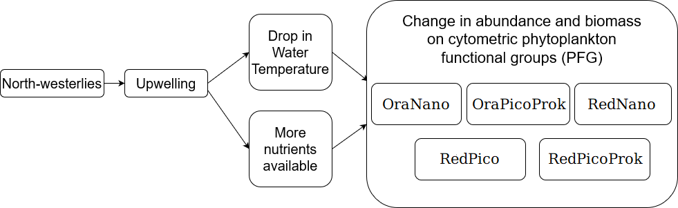

# PhytoUpwellingPaper

<div align="center">
  
</div>

<br/>

<div align="center">
  <!-- Python version -->
  <a href="https://pypi.python.org/pypi/">
    
  </a>
  <!-- License -->
  <a href="https://opensource.org/licenses/MIT">
    
  </a>
</div>

<br/>

## Installation prerequisites
This repository aims to reproduce the results from Fuchs et al. (2022): "Intermittent upwelling triggers delayed, yet major and reproducible, pico-nanophytoplankton responses in oligotrophic waters".

Before proceeding, please install:
- Python https://www.anaconda.com/products/distribution
- R https://cran.r-project.org/bin/windows/base/ and Rstudio https://www.rstudio.com/products/rstudio/download/

Download this repository using Git, GitHub Desktop, or by downloading the zip directly.
To do so, click on the green "Code" menu in the top right and choose the desired option.  
The downloaded (and unzipped if needed) directory will be referred to as the "root directory" in the sequel.
The root directory contains three subdirectories: the "Code" repository fetches the data in the "Data" repository and reproduces the results and figures in the "Results" and "Figures" directory.

Open the Python scripts in your favorite Python IDE (e.g. Spyder) or Rstudio (for .R files), and adapt the path to the root file on your computer:
For Python scripts, the line to change is the "os.chdir" command of each script.
Example in Code/main.py line 20:
```python
os.chdir('replace/this/path/with/the/root/directory/path/on/your/computer')
```

For R scripts, the line to change is the "setwd" command of each script.
Example in Code/size_class_model.R line 13:
```R
setwd('replace/this/path/with/the/root/directory/path/on/your/computer')
```

## Result reproduction
- Start by executing main.py (you may have to install additional packages)
- Run size_class_model.R. Again you may have to install additional packages. Please be careful to install version 1.1.0 of the ssPopModel package. The size-structure model-related results would not be reproducible otherwise
- Run concatenate_mu_loss.py
- Run SN_analysis.py
- Run blooms.py
- The other scripts can be run in any order

When possible the names of the scripts correspond to the Figure number they generate in the paper.
